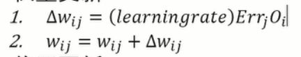
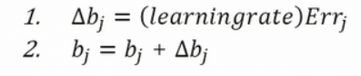
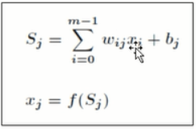

# 神经网络NN入门(neural network)

## 目标
* 了解NN的概念和基本算法
算法比较繁杂
NN 多层前向神经网络

	神经网络算法依赖GPU，要求计算机性能

	神经网络模拟人的概念

输入神经元数量是由特征值决定的，输出神经元数量是由标记分类所决定的

目标集是有隐藏层训练得来的

上层的权重w + 本层偏置 △ =本层数值

## NN算法 （BP=Back propagation）后向传播
		正算一次+倒算一次 为一个周期

* 特征值向量标准化mormalize（转化0-1之间的值）
* 随机初始化权重和偏置（-1,1）---初始值随机设置，后面会加以训练
* 传入样例
* 计算神经元的值
	1. 对上层输入加权求和
	2. 加上偏置值
	3. 用激励函数产生最后结果
		* f(x)= 1/(1+e^(-x))

前向计算完毕

后向传播
1. 根据误差反向传送
http://blog.csdn.net/acdreamers/article/details/44657439

2. 误差计算
	* 输出层 Err = （结果）（1-结果）（预期值-结果）
	* 隐藏层 Err = （结果）（1-结果）（后一层Err加权求和）
	* 权重更新

	* 偏重更新

3. 训练终止
	* 一定次数(epoch)
	* 既定错误率
	* 权重更新低于某个 threshold

4. 激励函数
	* 双曲函数
	* 逻辑函数
	* 阶跃函数
	。。。
5. Learning Rate
	* 步长（极值处小一些，前面大一些比较好）

## 训练NN
* 不断通过样例调整偏置和权重的过程
* 训练好的神经网络可以用于预测新的样例

# Tensorflow
* google开源的神经网络库
* 支持python /java/c
