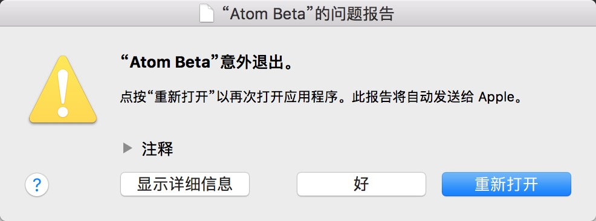

# Atom闪退问题解决办法
Atom是github出的一款非常好用的编辑器，最近总是遇到闪退的现象如下图所示

在网上搜寻时发现很多小伙伴都有这种问题，却没有效的解决方案，又不忍就此放弃，在百般探索之后，终于发现其中奥秘

## 请不要将你的Shadowsocks设置为自动代理模式
Shadowsocks设置为自动代理模式，Atom必闪退，而关闭和全剧模式却没有问题。屡试不爽。

- - -
2018.07.23
