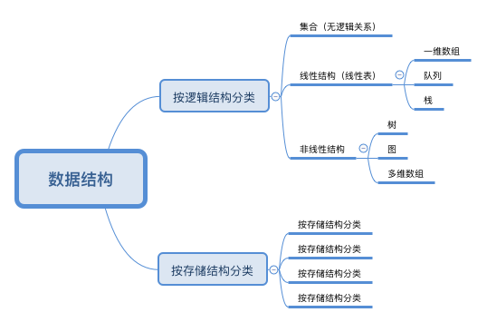
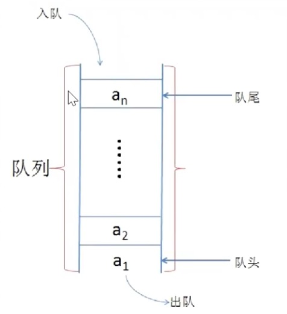
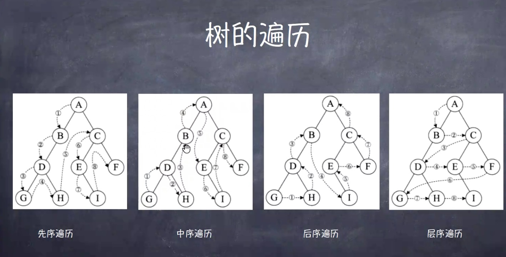
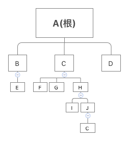
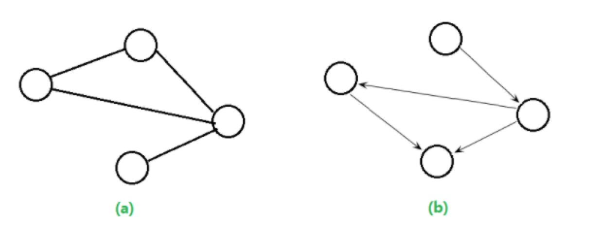

# 数据结构简介
数据对计算机、互联网来说，是无比重要，优秀的数据结构有利于优化存储和检索。作为互联网从业者，数据是打交道的主要对象。

## 数据结构的概念
* 广义说法：数据结构 = 数据存储 + 算法
* 狭义说法：数据结构 = 数据的存储
* 数据结构类似于建筑工程中的建筑图纸，表示了数据元素的排列方式，好的数据结构设计思想在软件开发中的重要性不言而喻。
    - 程序员的内功心法之一
    - 有利于有效地管理数据对象
    - 有利于优化性能问题

## 数据的基本概念
* **数据**: 本文讲的数据是计算机里面存储的数据
* **数据对象**: 很多数据元素组成的，能表达一个相对完整意义的，相对独立的数据存在。比如一个文件，一个音乐等
* **数据项**: 数据最小的单位，比如一个整型，一个字符串等
* **数据结构**: 数据项--->数据元素---->数据对象-->数据。组成的一个整体

## 基本数据结构及衍生结构
数据结构分类如下如下图(👇)所示



### **集合**：
* 集合中的数据成员是无序的
* 每个数据成员不能重复，仅且出现一次

### **线性表**：
线性表是用来储特定的某一类型的元素的数据结构，数据元素之间是一对一关系，一个接一个排列。线性表的物理结构是顺序表、链表等类型
* **顺序表**
    - 是线性表的顺序储存结构
    - 将线性表中的数据元素按照线性顺序存储到指定位置开始的、一块连续的存储空间中
    - 第一个元素没有***前驱***，最后一个元素没有***后继***
* **链表**：一个数据分多个内存块存储，链表结构分为值域和指针域
    - 单链表：指针域处于元素尾部，指向下一个元素地址，最后一个元素的指针域为NULL，代表结尾
    - 双向链表：拥有前后两个方向的链表，元素前后都有一个指针域，前指针域指向前驱元素地址，后指针域指向后继元素地址，第一个元素的前指针域和最后一个元素的后指针域为NULL，可以从任一个内存块开始查找，可双向查找，比单链表多一个前驱指针占用的内存
    - 循环链表： 循环的链表，它的遍历可以循环起来，可以是单向的，也可以是双向的。单向循环链表的尾指针指向的节点next域并不是NULL，而是首元素，也就是head->next，当遍历进行至链表末尾时，指针后移不会出现NULL，而是移至链表首位，形成循环
* **串**：它是一系列结点组成的一个线性表，每一个结点存储一个字符。

### **线性表衍生结构**

* **栈**：在顺序表基础上衍生的，操作受限的线性表
    * 有两个操作方式：pop、push
    * pop只能操作***栈顶***元素，push进来的新元素必须处于***栈顶***位置，***栈底***元素不许操作
    * LIFO(Last In First Out)，后进先出

    

    * 用途：解决括号匹配查找、浏览器的后退或编辑器的undo功能等


* **队列**：同样属于操作受限的线性表
    * ***队尾***和***队首***均可操作
    * 必须在***队尾***入队，***队首***出队
    * 特殊情况可插队（解决排序vip问题）
    * FIFO(First In First Out)，先入先出

    

    * 用途：消息队列、视频弹幕；维护打印机任务等

### 树
树是由若干个有限节点组成的一个具有层次关系的数据元素的集合
* 特点

```
* 数学基础： 图论
* 一棵树中每两个点之间有且只有一条路
* 一棵树有N个点，则有N-1条边
* 边：父子元素的连线叫边
* 非父子节点之间的连线叫路径
* 每个节点只有一个父节点（根节点没有父节点）
* 没有子节点的节点叫叶子节点
```

* 树的遍历：按照某种规则，不重复地访问某种树的所有节点
    - 先序遍历（深度优先）
    - 中序遍历（深度优先）
    - 后序遍历（深度优先）
    - 层序遍历（广度优先）

    

* 树的种类
    - 空树：空集合也是树，称空树，没有节点
    - 无序树：树中任意节点之间没有顺序关系，成为无序树，也称自由树
	- 有序树：任意节点之间的子节点有顺序关系（矢量）
	- 二叉树：每个节点最多含有两个子树
	- 完全二叉树：除了最后一层，其他各层节点数都达到最大
	- 满二叉树：每一层上的节点都是最大节点数
	- 霍夫曼树：带权路径最短，也叫最有二叉树

    

    上图中，C有三个字节点，***度(degree)***为3，H有两个子节点，***度(degree)***为2，叶子节点的***度(degree)*** 为0，此树***深(depth)*** 为4(从根节点0,1,2,3,4)

### 图
图是由***顶点集合*** 与定点间关系(边)所构成的一种数据结构。图分为有向图和无向图。



上图（a）为无向图，(b)为有向图

* 基本概念
    1. 图上两点之间路径不唯一。
    2. 对于图上任意两点都可以连通的图叫做连通图。
    3. 图的边是可以带权值的，一般代表路径长度。
    4. 图顶点的度：对于无向图来说，顶点的度就是其直接相邻的点的个数；对于有向图来说，顶点的度分为入度和出度，分别代表可直接到达的点的数量和可直接到达它的点的数量。如上图b中最右边的点的出度为2，入度为 1。
    5. 按照边的数量多少分为稀疏图和稠密图，应用中要根据图的稠密程度来使用不同的算法解决问题。
- - -
2018.1.24
