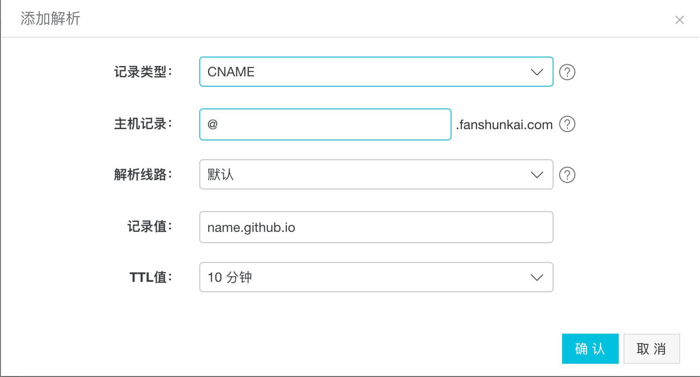

# 如何将万维网域名解析到自己的github pages

我们都知道，github给提供了pages的服务器，每个用户可以建一个名为**name.github.io**的repository，name为用户名，可以被git服务解析，在这里写博客方便快捷。其他仓库可以建一个**gh-pages**的分支，将你的生产环境代码放进去即可。

那么问题来了，我们想把自己的域名跟git的pages关联起来该怎么办呢，对一些大神来说，那不叫个事，但是对刚入门我来说是个大问题，查阅了不少资料，终于实现了需求，下面就把我的设置经历写下来，希望对有困惑的人有些帮助。大神请绕道。

## 一，材料
1. 首先你得有一个域名，有这需求的肯定有了，不多赘述，没有的可以去万网注册一个
2. github上建一个**name.github.io**的repository，或者你的其他repository建一个**gh-pages**的分支，确保浏览器可访问name.github.io/xxx

## 二，域名解析
去你的域名商那里做解析，现在好像要实名认证，听话认证了就是。我买的是阿里云的万网域名，以阿里云为例
1. 区域名列表找到你的域名，点解析

2. 做这两个解析即可

这是表单

记得记录值是你要跳转的地址，到此之止，域名解析已完成

## 三，创建CNAME文件
在你的仓库根目录创建CNAME文件，要大写，不要后缀，内容为你的域名，***example.com***，可以愉快的访问你的域名了

## 以上
