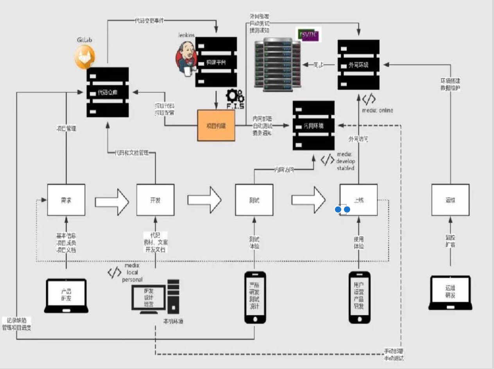
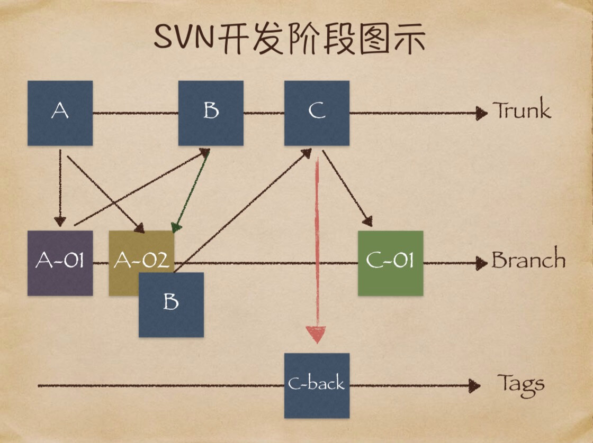

# 前端的持续集成


## 什么是持续集成（Continuous Integration）
* 通过平台串联各个环节，实现和沉淀工作自动化的方法
* 线上代码和代码仓库不同步，影响迭代和团队协作
* 静态资源发布依赖人工，浪费开发人力
* 缺少自动化测试，产品质量得不到保障
* 文案简单修改上线，需要技术介入

## 持续集成流程



1. 统一代码仓库通过分支管理合并主干SVN
2. 自动化构建工具，编译、部署、测试、监控、本机开发上线环境。
	FIS3/webpack/jdists/pachage.json/chai/supertest/mocha/selenuim-webdruver
3. 持续集成平台。Jenkins、Travis CI
4. 部署工具。rsync  shelljs yargs
5. 运营同学有权限操作运营页面，保存即可上线

## 多分支开发
* 以svn为例，下面是svn开发阶段图示



* 代码合成步骤
	1. svn checkout svn 地址 --suername 用户名
	2. svn branch 分支名
	3. svn merge 主干svn地址 分支svn地址
	4. Beyond Compare -> svn resolved
	5. svn copy 主干svn地址 /tags/2017


## 前端工程化 front-end engineering
* 自动化编译
	foo.es <-- foo.scss <-- foo.png
	1. 读入foo.es的文件内容，编译成js内容
	2. 分析js内容，找到资源定位标记'foo.scss'
	3. 对foo.scss进行编译
		- 读入foo.scss文件内容，编译成css内容
		- 分析css内容，找到资源定位标记'url(foo.png)'
		- 对foo.png进行编译
			- 读入foo.png的内容
			- 图片压缩
			- 返回图片内容
		- 根据foo.png的最终内容计算md5戳，替换url(foo.png)为url(/static/img/foo_2af0b.png)
		- 替换完毕所有资源定位标记，对css内容进行压缩
		- 返回css内容
	4. 根据foo。css最终内容计算MD5戳，替换为'foo.scss'为'/static/scss/foo_base39.css'
	5. 替换完毕所有资源定位标记，对js内容进行压缩
	6. 返回js内容
	7. 根据最终的js内容计算md5戳，得到foo.coofee的资源为'/static/script/foo_3fc20.js'


* 前端模块化
	1. 前端模块化肩负模块管理，资源家在两项重要功能，这两项功能与工具、性能、业务、部署等工程环节都有着非常紧密的联系。因此，模块化框架的设计应该最高优先级考虑工程需要
	2. CommonJS API定义了很多普遍应用程序使用的api。终极目标是提供一个类似python ruby和java标准库
	3. MCD和AMD都是CommonJS的一种规范的实现，RequireJS和Seajs是对应的实践

	```
	// AMD
	define(['dep1','dep2'],function(dep1,dep2){
		//内部只能使用指定的模块
		return function(){};
		})

	// CMD
	define(function(require,exports,module){
		// 此处可以引入需要加载的模块

		var xx = require ('xx')
		})
	```
	4. 优缺点
		- CMD 依赖是就近声明。但是因为是异步模块，加载器需要提前加载这些模块，所以模块真正使用需要提取里面所有的依赖
		- 不能直接压缩，require局部变量无法加载资源
		- CMD路径不能进行字符串运算
		- AMD一来是提前声明。依赖梧桐果静态分析，加载器和自动化工具都可以很直接的获取到依赖
		- AMD依赖提前声明在代码书写上不是那么友好
		- AMD模块内部与NODEJS的Modules有一定的差异
		- requirejs和seajs在加载上都有缺陷，模块的恶意来要等到模块加载完成后，通过静态分析（seajs）或者deps参数（requirejs）来获取，为合并请求和按需加载带来了实现上的矛盾---->要么放弃按需加载，把所有js合成一个文件；要么放弃请求合并，请求独立模块，满足按需加载

		```
		require(['page/index','page/detail'],function(index,detail){
			switch(location.hash){
				case "#index":
					index();
					.....
			}
		})
		```

		- 以纯前方式实现模块化框架不能同时满足按需加载，请求合并和依赖管理三个需求
	5. webpcak
	为什么选择webpack
		- webpack执行Commonjs标准，解决了以来配置和请求流量
		- 对webpack来讲万物都可以是模块，所有的问价都被合并到js中，最终在浏览器
		- 兼容AMD和CMD
		- js模块化不仅仅是为了提高代码复用性，更是为了让资源文件更合理地进行缓存
	6. 其它
		- spm3 辅助seajs打包节省网络流量
		- fis3根据分析好的文件包，利用hook插件定位资源
		- webpack在开发阶段打包，利用插件分析提取。Fileloader && extract-text-webpack-plugin
		- 配置publicpath分发到CDN

* 定位静态资源
	1. 配置长时间的本地缓存--节省快带，提高性能
	2. 采用内容摘要作为缓存更新一句--精确的缓存机制
	3. 静态资源CDN部署--优化网络请求
	4. 更新资源发布路径实现费覆盖式发布--平滑升级

* 前端开发组件化

* 自动化部署测试配合版本库
* 自动化性能优化

## 前端开发组件化
1. 每一个前端模块都是一个小项目，配合mock.js可以惊醒本地开发测试，根据package.json管理依赖模块，经过webpack的环境配置统一惊醒本地环境，上线环境的编译过程
2. 由page组装widget，由widget组装web Component（X-Tag）

## Web Component
1. Custom Elements

	```
	class ButtonHelloElement extends HTMLButtonElement {
		constructor() {
			super()
			this.addEventListener('click', () => {
				alert('hello world')
			})
	    	 }
	}
	customElements.define('button-hello', ButtonHelloElement, { extends: 'button' })

	 <button is="button-hello">hello world</button>
	```
2. HTML Imports
	HTML Imports 是一种在 HTMLs 中引用以及复用其他的 HTML 文档的方式。这个 Import 很漂亮，可以简单理解为我们 常见的模板中的 include 之类的作用。

	```
	<link rel="import" href=“/components/header.html"> const link = document.querySelector('link[rel=import]') const header = link.import;
	const pulse = header.querySelector(‘div.logo');
	const d = document.currentScript.owerDocument                                                                
	```
3. HTML Templates
	用过 handlebars 的人都知道有这么一个东西:
	<script id="template" type="text/x-handlebars-template">
	</script>那么 HTML Templates 便是把这个东西官方标准化，
	提供了一个 template 标签来存放以后需要但是暂时不渲染
	的 HTML 代码。
	```
	<template id="template"><p>Smile!</p></template>
	 <script>
		let num = 3;
		const fragment = document.getElementById('template').content.cloneNode(true);
		while (num-- > 1) {
			fragment.firstChild.before(fragment.firstChild.cloneNode(true));
			 fragment.firstChild.textContent += fragment.lastChild.textContent;
		}
		document.body.appendChild(fragment);
	</script>
	```
4. Shadow DOM
	Shadow DOM 最本质的需求是需要一个隔离组件代码作用域的东 西，例如我组件代码的 CSS 不能影响其他组件之类的，而 iframe 又太重并且可能有各种奇怪问题。旨在提供一种更好地 组织页面元素的方式，来为日趋复杂的页面应用提供强大支持， 避免代码间的相互影响。

	```
	const div = document.getElementById('id')
	const shadowRoot = div.createShadowRoot()
	const span = document.createElement('span')
	span.textContent = 'hello world' shadowRoot.appendChild(span)
	<x-foo>
		<"shadow tree">
			<div>
				<span id="not-top">...</span>
			</div>
		<span id="top">...</span> </>
	</x-foo>

	```
	x-foo::shadow >span 可以匹配到#top元素
	x-foo/deep/span 可以匹配到#not-top和#top元素
	:host(.foo)匹配<x-foo>元素


## 自动化部署
* 工具
 	Jenkins Travis CI
* 内容
	- 自动化运营平台
	- 自动化雪碧图
	- 自动化离线打包
	- 自动化控制缓存级别
	- 自动化处理inline
	- 自动化根据网速分发版本资源
	- 自动化运维平台

## 持续集成
1. 持续集成
2. 持续集成流程图搞清楚
3. svn/git 处理分支
4. shell.js  js写shell脚本
5. web components 可以理性选择项目中用什么库
6. webpack rollup gulp 。。。语法规则
7. jenkins travis ci
8. 代码开发阶段 以保存 浏览器自动刷新  一提交 自动化测试并部署到测试机
css next


- - -
2017.11.24
