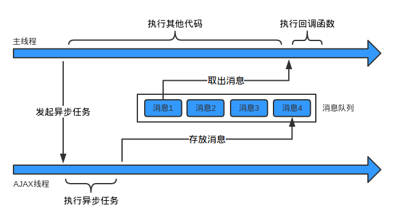

# javascript 运行机制

## 0、概念

### ECMAScript

ECMAScript是一种由Ecma国际（前身为欧洲计算机制造商协会,英文名称是European Computer Manufacturers Association）通过ECMA-262标准化的脚本程序设计语言。

### ECMAScript和javascript关系

1996年11月，JavaScript 的创造者 Netscape 公司，决定将 JavaScript 提交给国际标准化组织ECMA，希望这种语言能够成为国际标准。次年，ECMA 发布262号标准文件（ECMA-262）的第一版，规定了浏览器脚本语言的标准，并将这种语言称为 ECMAScript，这个版本就是1.0版。

该标准从一开始就是针对 JavaScript 语言制定的，但是之所以不叫 JavaScript，有两个原因。一是商标，Java 是 Sun 公司的商标，根据授权协议，只有 Netscape 公司可以合法地使用 JavaScript 这个名字，且 JavaScript 本身也已经被 Netscape 公司注册为商标。二是想体现这门语言的制定者是 ECMA，不是 Netscape，这样有利于保证这门语言的开放性和中立性。

因此，ECMAScript 和 JavaScript 的关系是，前者是后者的规格，后者是前者的一种实现（另外的 ECMAScript 方言还有 Jscript 和 ActionScript）。日常场合，这两个词是可以互换的。

## 一、单线程？

### 浏览器其实是多线程的

- js线程
- GUI渲染线程
- Http请求的线程
- 事件触发线程
- 定时器线程
- ...

### 所谓单线程？

指的是js线程(主线程)，基于事件驱动，js引擎一直轮询任务队列，执行队列中的任务

html5主线程是可以开辟多线程的，Web Worker

## 二、同步和异步？

### 同步

假设存在一个函数A：

A(args...);

如果在函数A返回的时候，调用者就能够得到预期结果(即拿到了预期的返回值或者看到了预期的效果)，那么这个函数就是同步的。


- 同步例子1：

```
主线程：“你好，AJAX线程。请你帮我发个HTTP请求吧，我把请求地址和参数都给你了。”
AJAX线程：“......”
主线程：：“喂，AJAX线程，你怎么不说话？”
AJAX线程：“......”
主线程：：“喂！喂喂喂！”
AJAX线程：“......”
(一炷香的时间后)
主线程：：“喂！求你说句话吧！”
AJAX线程：“主线程，不好意思，我在工作的时候不能说话。你的请求已经发完了，拿到响应数据了，给你。”
```

- 同步例子2：

```javascript
Math.sqrt(2);
console.log('Hi');
```


### 异步

如果在函数A返回的时候，调用者还不能够得到预期结果，而是需要在将来通过一定的手段得到，那么这个函数就是异步的。

- 异步例子1：

```
主线程：“你好，AJAX线程。请你帮我发个HTTP请求吧，我把请求地址和参数都给你了。”
AJAX线程：“好的，主线程。我马上去发，但可能要花点儿时间呢，你可以先去忙别的。”
主线程：：“谢谢，你拿到响应后告诉我一声啊。”
(接着，主线程做其他事情去了。一顿饭的时间后，它收到了响应到达的通知。)
```

- 异步例子2：

```javascript
fs.readFile('foo.txt', 'utf8', function(err, data) {
    console.log(data);
});
```

## 三、异步过程？

异步过程定义为整个异步操作所有工作的过程.

### 过程描述

1. 主线程发起一个异步请求
2. 相应的工作线程接收请求并告知主线程已收到(异步函数返回)
3. 主线程可以继续执行后面的代码，同时工作线程执行异步任务；
4. 工作线程完成工作后，通知主线程；(加入任务队列)
5. 主线程收到通知后（任务队列循环），执行一定的动作(调用回调函数)。

### 函数形式
异步函数通常具有以下的形式：
```
A(args..., callbackFn)
```
它可以叫做异步过程的发起函数，或者叫做异步任务注册函数。args是这个函数需要的参数。callbackFn也是这个函数的参数，但是它比较特殊所以单独列出来。

### 要素
从主线程的角度看，一个异步过程包括下面两个要素：
- 发起函数(注册函数) A
- 回调函数 callbackFn

它们都是在主线程上调用的，其中注册函数用来发起异步过程，回调函数用来处理结果。

```javascript
setTimeout(fn, 1000);
```

其中的setTimeout就是异步过程的发起函数，fn是回调函数。

### 注意

前面说的形式A(args..., callbackFn)只是一种抽象的表示，并不代表回调函数一定要作为发起函数的参数，例如：

```javascript
var xhr = new XMLHttpRequest();
xhr.onreadystatechange = xxx; // 添加回调函数
xhr.open('GET', url);
xhr.send(); // 发起函数
```

发起函数和回调函数就是分离的。


## 四、任务队列和事件循环

异步过程中，工作线程在异步操作完成后需要通知主线程。那么这个通知机制是怎样实现的呢？

答案：
```
 利用任务队列和事件循环.
 工作线程将消息放到任务队列，主线程通过事件循环过程去取消息.
```

### 任务队列(Task Queue)

任务队列是一个先进先出的队列，它里面存放着各种任务消息

### 事件循环(Event Loop)

事件循环是指主线程重复从任务队列中取任务、执行的过程

主线程只会做一件事情，就是从任务队列里面取任务、执行任务，再取任务、再执行。当任务队列为空时，就会等待直到任务队列变成非空。而且主线程只有在将当前的任务执行完成后，才会去取下一个任务。这种机制就叫做事件循环机制，取一个消息并执行的过程叫做一次循环。

事件循环用代码表示大概是这样的：
```javascript
while(true) {
    var message = queue.get();
    execute(message);
}
```

### 消息

消息就是注册异步任务时添加的回调函数。

- 例子：

先发起异步AJAX

```javascript
$.ajax('http://aa.com', function(resp) {
    console.log('我是响应：', resp);
});
```

主线程在发起AJAX请求后，会继续执行其他代码。AJAX线程负责请求aa.com，拿到响应后，它会把响应封装成一个JavaScript对象，然后构造一条消息：

```javascript
// 任务队列中的任务就长这个样子
var message = function () {
    callbackFn(response);
}
```
其中的callbackFn就是前面代码中得到成功响应时的回调函数。

### 图表示



主线程在执行完当前循环中的所有代码后，就会到任务队列取出这条消息(也就是message函数)，并执行它。到此为止，就完成了工作线程对主线程的通知，回调函数也就得到了执行。如果一开始主线程就没有提供回调函数，AJAX线程在收到HTTP响应后，也就没必要通知主线程，从而也没必要往任务队列放消息。


## 五、DOM事件

DOM事件就是一个异步过程

- 例子

```javascript
var button = document.getElement('#btn');
//addEventListener异步函数
button.addEventListener('click',
	//回调函数
	function(e) {
    	console.log();
	}
);
```

## 六、定时器

### setTimeout

1秒后将控制台输出的回调函数加入任务队列
```javascript
setTimeout(function() {
    console.log('hello');
},1000)
```

### setInterval

跟setTimeout一样，每隔几秒将回调函数加入任务队列

## 七、生产者与消费者

工作线程是生产者，主线程是消费者(只有一个消费者)。工作线程执行异步任务，执行完成后把对应的回调函数封装成一条任务放到任务队列中；主线程不断地从任务队列中取任务并执行，当任务队列空时主线程阻塞，直到任务队列再次非空。

## web worker

所有主流浏览器均支持 web worker，除了 Internet Explorer

例子：./test1

## 八、总结

最后再用一个生活中的例子总结一下同步和异步：在公路上，汽车一辆接一辆，有条不紊的运行。这时，有一辆车坏掉了。假如它停在原地进行修理，那么后面的车就会被堵住没法行驶，交通就乱套了。幸好旁边有应急车道，可以把故障车辆推到应急车道修理，而正常的车流不会受到任何影响。等车修好了，再从应急车道回到正常车道即可。唯一的影响就是，应急车道用多了，原来的车辆之间的顺序会有点乱。

这就是同步和异步的区别。同步可以保证顺序一致，但是容易导致阻塞；异步可以解决阻塞问题，但是会改变顺序性。改变顺序性其实也没有什么大不了的，只不过让程序变得稍微难理解了一些 :)
