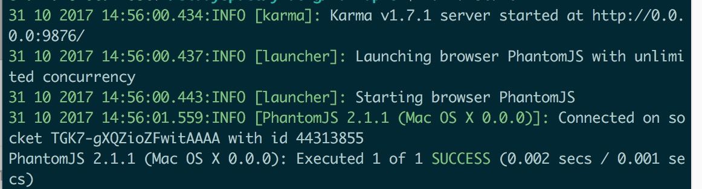

# karma & jasmine PhantomJS

**Karma**是一个基于Node.js的JavaScript测试执行过程管理工具（Test Runner）。该工具可用于测试所有主流Web浏览器，也可集成到CI（Continuous integration）工具，也可和其他代码编辑器一起使用。这个测试工具的一个强大特性就是，它可以监控(Watch)文件的变化，然后自行执行，通过console.log显示测试结果。

**jasmine**是一款基于js的BDD(行为驱动开发的)测试库，在Karma上运行Jasmine可完成Javascript的自动化测试、生成覆盖率报告

**PhantomJS**是无头浏览器

## 一、安装

```
$ npm install -g karma
$ npm install -g jasmine-core
$ npm install -g karma-jasmine
```

## 二、初始化

```
$ karma init
```
测试库选 jasmine yes或no的选no，浏览器选phantomJs

## 三、配置karma.conf.js

```
module.exports = function(config) {
  config.set({

    // base path that will be used to resolve all patterns (eg. files, exclude)
    basePath: '',


    // frameworks to use
    // available frameworks: https://npmjs.org/browse/keyword/karma-adapter
    frameworks: ['jasmine'],


    // list of files / patterns to load in the browser
    files: [
        './src/**/*.js', //待测试文件
        './test/**/*.spec.js'  //测试文件
    ],


    // list of files to exclude
    exclude: [
    ],


    // preprocess matching files before serving them to the browser
    // available preprocessors: https://npmjs.org/browse/keyword/karma-preprocessor
    preprocessors: {
    },


    // test results reporter to use
    // possible values: 'dots', 'progress'
    // available reporters: https://npmjs.org/browse/keyword/karma-reporter
    reporters: ['progress'],


    // web server port
    port: 9876,


    // enable / disable colors in the output (reporters and logs)
    colors: true,


    // level of logging
    // possible values: config.LOG_DISABLE || config.LOG_ERROR || config.LOG_WARN || config.LOG_INFO || config.LOG_DEBUG
    logLevel: config.LOG_INFO,


    // enable / disable watching file and executing tests whenever any file changes
    autoWatch: false,


    // start these browsers
    // available browser launchers: https://npmjs.org/browse/keyword/karma-launcher
    browsers: ['PhantomJS'],


    // Continuous Integration mode
    // if true, Karma captures browsers, runs the tests and exits
    singleRun: true, //允许单独运行

    // Concurrency level
    // how many browser should be started simultaneous
    concurrency: Infinity
  })
}
```
## 四、启动

```
$ karma start
```
看到下面的效果，测试成功



* * *
2017.10.30
