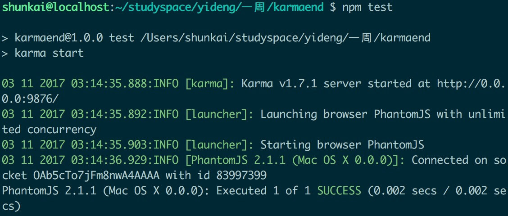

# 基于**karma** **jsmine** phantomjs **system** **babel**的自动化测试ES6工程
一直想做一个自动化测试的项目，终于动笔，选择了**karma**和**jasmine**作为测试框架和断言库，结合无头浏览器 phantomjs，用万能模块加载器**systemjs**做模块管理，编译**ES6**当然是用**Babel**了

闲话少叙，下面开工

## gulp
使用gulp实现起服务，自动编译less和ES6
* 1.安装gulp

    ```
    $ npm install gulp -g
    ```

    运行 gulp -v 检查是否安装成功

    ```
    $ gulp -v
    ```
    如果出现版本号，安装成功
* 2.在项目目录安装connect,less和babel
    ```
    $ npm init -y  //npm初始化
    $ npm install gulp gulp-connect gulp-less gulp-babel babel-core babel-preset-es2015 --save-dev
    ```
* 3.创建gulpfile.js
创建gulpfile.js并编写gulp task


```
var gulp = require('gulp'),
connect = require('gulp-connect'),
less = require('gulp-less'),
babel = require('gulp-babel')


gulp.task('server',function(){
	connect.server({
		port:'8000'
	})
})

gulp.task('css',function(){
	gulp.src('style/*.less')
	.pipe(less())
	.pipe(gulp.dest('./style'))
})

gulp.task('es6',function(){
	gulp.src('./scripts/index.js')
	.pipe(babel())
	.pipe(gulp.dest('./dest'))
})
gulp.task('watch',function(){
    	gulp.watch('./style/**/*.less',['css']);
    	gulp.watch('./scripts/**/*.js',['es6']);
})
gulp.task('default',['css','es6','watch','server'],function(){
	console.log('success')
})
```

运行gulp,自动编译es6和less

    ```
    $ gulp
    ```
如果出现下面的画面，gulp配置成功


## 引入systemjs
* 在index.html中引入systemjs

```
<script src="./libs/system.js"></script>
<script src="https://cdn.bootcss.com/jquery/3.2.1/jquery.min.js"></script>
```

* 使用systemjs加载编译后的js,并且把写的Thumb插件扩展到jq上

```
<script >

	SystemJS.import('./dest/index.js').then(m=>{
		$.extend({
			Thumb:m.Thumb
		})
		let f = new $.Thumb($('.warp'),0);
		f.action()


	})
</script>

```

## 功能实现
index.js
```
import './add.js'

export class Thumb{
	constructor(ele,num){
		this.ele = ele;
		this.num = num;
	}
	action () {
		this.ele.one('click',this.handleClick.bind(this))
	}
	handleClick(){
		if(this.num<10){
			this.num = add(this.num)
			this.ele.find('.add').fadeIn(100).fadeOut(1000)
			if(this.num === 10) this.ele.addClass('disable')
		}else{
			this.num = 0;
			this.ele.removeClass('disable')

		}
		console.log(this.num)
		setTimeout(()=>{
			this.ele.one('click',this.handleClick.bind(this))
		},600)

	}
}
```
add.js是要测试的纯函数
```
window.add = function(num){
	return ++num;
}
```
功能实现完毕，下面配置karma，进行单元测试
## 配置karma
* 安装karma

```
$ npm install karma karma-jasmine jasmine-core karma-phantomjs-launcher --save-dev
```

* 配置scripts
在package.json中配置相关scripts命令
```
"scripts": {
   "test": "karma start",
   "karmainit":"karma init",
   "start": "gulp"
 },
```
* 初始化karma
```
$ npm run karmainit
```
选择 jasmine phantomjs 其余默认

生成karma.conf.js文件

* 配置karma.conf.js
files中配置目标测试文件和测试用例,singleRun设为true
```
files: [
      './dest/add.js',
      './test/add.spec.js'
  ],...
singleRun:true
```
* 写测试用例
在./test/add.spec.js文件中写用例

```
describe('测试加法函数',function(){
	it('测试add(1)是否等于2',function(){
		expect(add(1)).toBe(2);
	})
})
```
* 运行karma进行单元测试

```
$ npm run test
```
出现下面画面



测试通过，我们可以修改测试用例

```
describe('测试加法函数',function(){
	it('测试add(1)是否等于2',function(){
		expect(add(1)).toBe(3);
	})
})
```
再运行karma
```
$ npm run test
```

则会报测试不通过，如下图


## 完成
到此，我们已经完成了一个点赞的插件，扩展在了jq对象上，支持单元测试，还有事件稀释哦
* 运行项目
```
$ git clone https://github.com/fengzhike/thumb.git
$ cd thumb
$ gulp 或者 npm start  //启动项目
$ gulp test   //单元测试
```


* * *
2017.11.03
