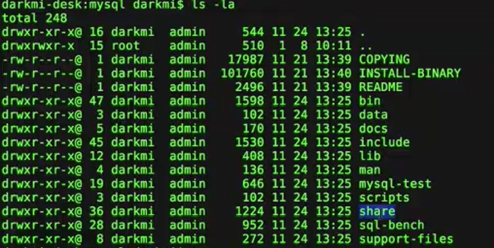

# MySQL的安装与基础操作
一直想学习一些数据库方面东西，比较喜欢MySQL这款开源的关系型数据库。这里对安装和基础操作做一个简单介绍，方便以后查阅，也希望能帮到初学的读者

## MySQL简介
* MySQL是一个小型的关系型数据库管理系统，现属于Oracle公司
* LNMP或LAMP或XAMPP是流行的互联网架构，其中M指的是MySQL
## 在Mac上安装MySQL
* 访问mysql.com并下载社区版，选择第一个就好了，下载后把下载的包文件拷贝到/usr/local目录下
```
$ cp mysql-5.6.22-osx10.9-x86_64.tar.gz /usr/local
```
* 进入/usr/local，并解压mysql
```
$ cd /usr/local
$ tar zxvf mysql-5.6.22-osx10.9-x86_64.tar.gz
```

* 重命名MySQL
```
$ mv mysql-5.6.22-osx10.9-x86_64 mysql
```

* 进入MySQL
```
$ cd mysql
$ ls -al
```

* MySQL目录结构介绍



|目录|作用|
|:-|:-:|
|bin|常用工具及管理工具|
|data|数据文件和日志文件|
|docs|帮助文档|
|include|mysql依赖的头文件和库函数|
|lib|mysql依赖的头文件和库函数|
|man|帮助文档|
|scripts|mysql的脚本文件，初始化脚本也在这里|
|share|错误文件和信息|

* 初始化MySQL

```
$ ./scripts/mysql_install_db
$ ./bin/mysqld
```


mysql已经启动了
* 链接MySQL
新打开一个终端窗口
```
$ mysql -u root
```

使用root用户登录 -u username -p passwd
输入密码进入mysql界面

* MySQL常用命令
所有命令必须以";"结尾

```
//查看所有数据库
mysql> show databases;

//进入test数据库
mysql> use test;

//查看test下所有的表
mysql> show tables;

//退出MySQL操作界面
mysql> quit;
mysql> exit;
mysql> \q;
```

* 关闭MySQL
通过杀死进程关闭
```
$ ps -ef |grep mysql
$ kill $pid
```

推荐xampp

## windows上安装mysql
* 同mac，下载社区版
* 双击MySQL的msi文件，全部下一步安装
* 设置root密码，和随系统启动
* 目录结构与mac相似
* cmd进入bin目录
```
$ mysql -u root -p
```
]
输入密码，进入mysql的管理界面，同mac，暴力关闭可以用任务管理器杀死进程

## ubuntu上安装MySQL
* apt-get简介
    - Advanced Packaging Tools
    - 软件包管理器，能下载二进制的软件包
* apt-get [选项] 命令
* 选项说明

|选项|作用|
|:-|:-:|
|update|获取软件包列表|
|install|安装软件包|
|remove|移除软件包|
|autoremove|移除不使用的软件包|
|purge|移除软件包和配置文件|
|upgrade|升级指定的软件包|
|source|下载指定包的源码|
|check|检测依赖是否有损坏|

* 安装MySQL
```
$ sudo apt-get install mysql-server
```

根据提示输入root用户密码

* 查看MySQL是否已经启动
```
$ ps -ef}grep mysqld
```

如果出现mysqld，说明MySQL已经启动
* 访问MySQL数据库
访问，查看同mac
* 移除MySQL
```
$ sudo apt-get autoremove --purge mysql-server
```


- - -
2017.12.03
