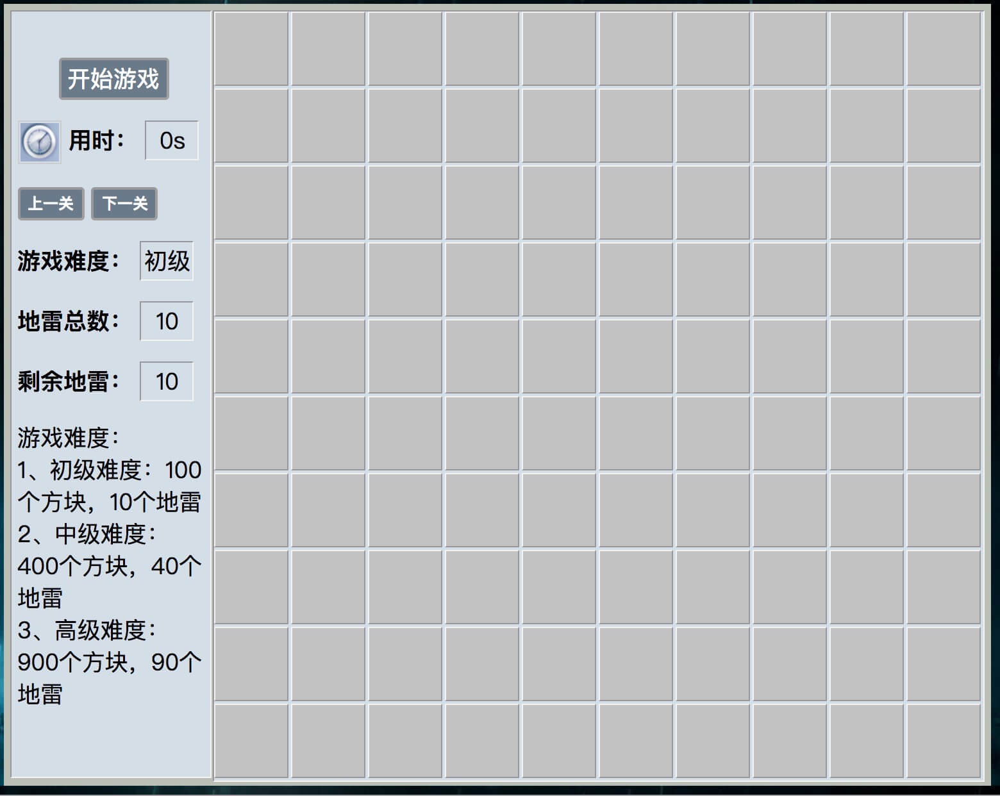
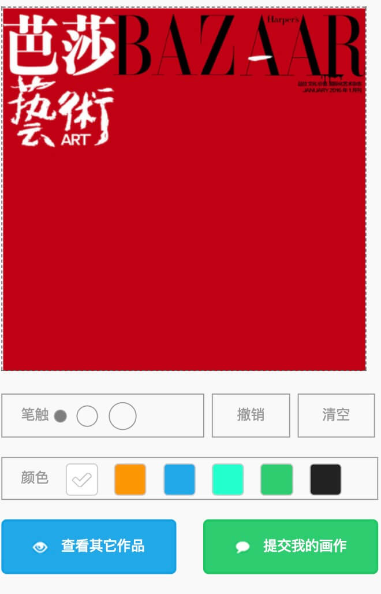
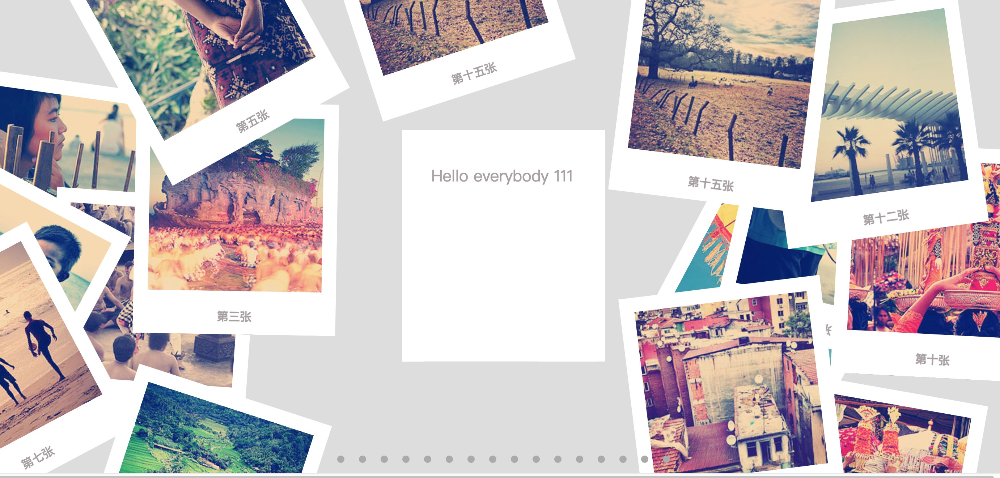

### 一 早期学习js，用原生js写的小游戏

[https://fengzhike.github.io/mine/](https://fengzhike.github.io/mine/ "点击试玩") 点击试玩

---

### 二 移动端canvas涂鸦

[https://fengzhike.github.io/tuya/](https://fengzhike.github.io/tuya/ "点击试玩") 手机打开效果更好

---

### 三 react学习产物--画廊

[https://fengzhike.github.io/react_pic_demo/](https://fengzhike.github.io/react_pic_demo/ "画廊") 点击预览
