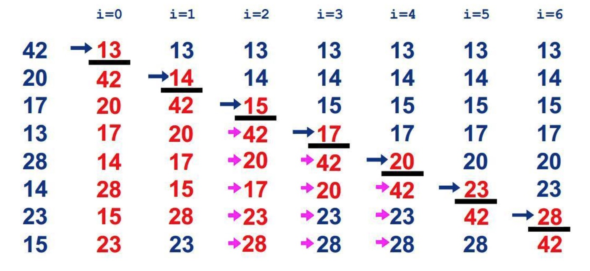
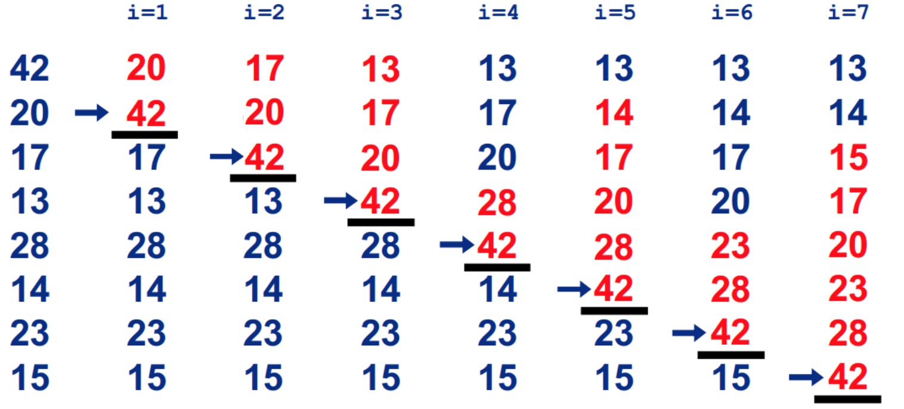
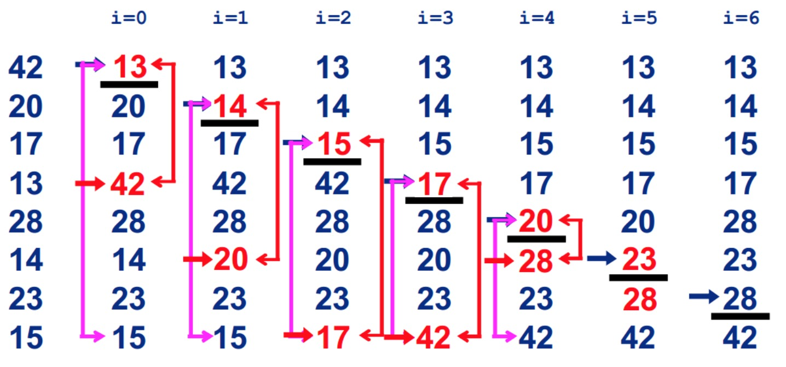
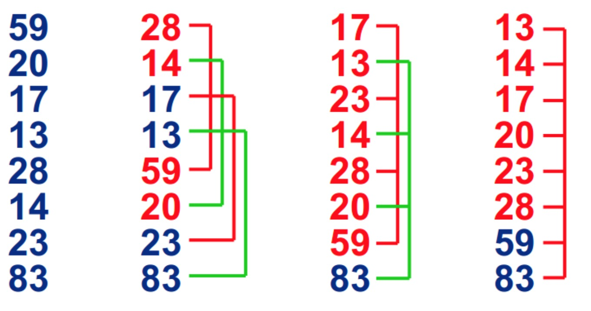
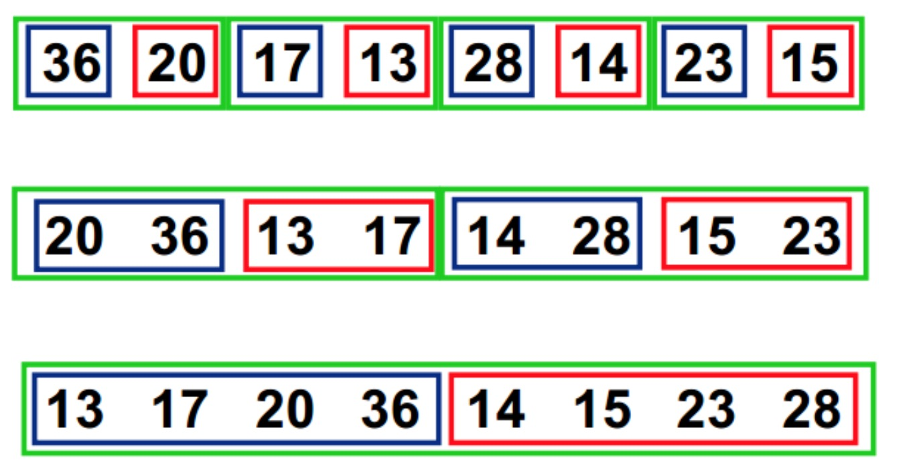

# 排序算法
对计算机存储的数据对计算机存储的数据执行最常见的两种操作是排序和检索。这里介绍六种排序算法：冒泡排序、插入排序、选择排序、希尔排序、快速排序、归并排序。其中前三种属于基本排序算法，后三种属于高级排序算法

* 以上六种排序算法的比较

|排序算法|时间复杂度(平均)|稳定性|复杂性|特点|
|:-:|:-|:-|:-|:-|
|冒泡排序|O(N^2)|稳定|简单|1. 冒牌排序是以空间换时间的排序方法，N小时较好 <br/>2. 最坏情况是样本按逆序排列，最差时间复杂度O(N^2)只是表示其操作次数的数量级<br/>3. 最好情况是顺序排列，时间复杂度为O(N)|
|插入排序|O(N^2)|稳定|简单|N小时较好，适用于大部分已排好的样本，此时的时间复杂度为O(N)|
|选择排序|O(N^2)|不稳定|简单|N小时较好|
|希尔排序|O(N^1.5))|不稳定|复杂|适合数据量在5000以下,速度并不重要的场合。|
|归并排序|O(NlogN)|稳定|复杂|把一系列排好序的子序列合并成一个大的完整有序序列|
|快速排序|O(NlogN)|不稳定|复杂|以一个元素作为基准值,将列表中小于基准值的放入数组底部大于放顶部|

## 冒泡排序
1. **基本思想**：两个数比较大小，大的下沉，小的上浮，像冒泡一样

    
2. js实现
```javascript
function bubbleSort(array){
    for (let i=array.length-1;i>=1;i--){
        for(let j=i-1;j>=0;j--){
            if(array[j]>array[i]){
                let temp = array[i];
                array[i] = array[j];
                array[j] = temp;
            }
        }
    }
    return array
}
console.log(bubbleSort([10,8,3,2,9,4,5,7])) //[2, 3, 4, 5, 7, 8, 9, 10]
```
## 插入排序
1. **基本思想**：在要排序的一组数中，假定前n-1个数已经排好序，现在将第n个数插到前面的有序数列中，使得这n个数也是排好顺序的。如此反复循环，直到全部排好顺序。

    
2. js实现
```javascript
function insertSort(array=[]){
    var temp,inner;
    for (let i = 1;i<array.length;i++){
        temp = array[i]
        inner = i;
        while(inner>0 && array[inner-1]>= temp){
            array[inner] = array[inner-1];
            inner -- ;
        }

        array[inner] = temp;
    }
    return array
}
console.log(insertSort([10,8,3,2,9,4,5,7])) //[2, 3, 4, 5, 7, 8, 9, 10]
```

## 选择排序
1. **基本思想**：在长度为N的无序数组中，第一次遍历n-1个数，找到最小的数值与第一个元素交换；
第二次遍历n-2个数，找到最小的数值与第二个元素交换；
。。。
第n-1次遍历，找到最小的数值与第n-1个元素交换，排序完成。

    
2. js实现
```javascript
function selectSort (array){
    var min;
    for (var i =0;i<array.length-2;++i){
        min=i;
        for(var j = i+1;j<=array.length-1;++j){
            if(array[j]<array[min]){
                min = j
            }
        }
        let temp = array[i];
        array[i] = array[min];
        array[min] = temp;
    }
    return array
}
console.log(selectSort([10,8,3,2,9,4,5,7])) //[2, 3, 4, 5, 7, 8, 9, 10]
```

## 希尔排序
1. **基本思想**：在要排序的一组数中，根据某一增量分为若干子序列，并对子序列分别进行插入排序。<br/>
然后逐渐将增量减小,并重复上述过程。直至增量为1,此时数据序列基本有序,最后进行插入排序。

    
2. js实现
```javascript
function shellSort(array){
    var len = array.length;
    for (var fraction = Math.floor(len / 2); fraction > 0; fraction = Math.floor(fraction / 2)) {
        for (var i = fraction; i < len; i++) {
            for (var j = i - fraction; j >= 0 && array[j] > array[fraction + j]; j -= fraction) {
                var temp = array[j];
                array[j] = array[fraction + j];
                array[fraction + j] = temp;
            }
        }
    }
    return array;
}
console.log(shellSort([49, 38, 65, 97, 76, 13, 27, 49, 55, 4]))//[4, 13, 27, 38, 49, 49, 55, 65, 76, 97]
```

## 归并排序
1. **基本思想**：归并排序是建立在归并操作上的一种有效的排序算法。该算法是采用分治法的一个非常典型的应用。
首先考虑下如何将2个有序数列合并。这个非常简单，只要从比较2个数列的第一个数，谁小就先取谁，取了后就在对应数列中删除这个数。然后再进行比较，如果有数列为空，那直接将另一个数列的数据依次取出即可。

    
2. js实现
```javascript
function merge(left, right) {  
    var result = [];  
    while(left.length > 0 && right.length > 0) {  
       if(left[0] < right[0]) {  
           result.push(left.shift());  
       }  
       else {  
           result.push(right.shift());  
       }  
   }  
   /* 当左右数组长度不等.将比较完后剩下的数组项链接起来即可 */  
   return result.concat(left).concat(right);  
}  
function mergeSort(arr){  
    if(arr.length==1) {return arr};  
    var mid=Math.floor(arr.length/2);  
    var left_arr=arr.slice(0,mid),right_arr=arr.slice(mid);  
    return merge(mergeSort(left_arr),mergeSort(right_arr));  
}
mergeSort([49, 38, 65, 97, 76, 13, 27, 49, 55, 4])//[4, 13, 27, 38, 49, 49, 55, 65, 76, 97]
```

## 快速排序
1. **基本思想**：
    1. 先从数列中取出一个数作为key值；
    2. 将比这个数小的数全部放在它的左边，大于或等于它的数全部放在它的右边；
    3. 对左右两个小数列重复第二步，直至各区间只有1个数。
2. js实现

```javascript
function quickSort(arr){  
    if(arr.length<=1){//如果数组只有一个数，就直接返回；  
        return arr;  
    }  
    var num=Math.floor(arr.length/2);//找到中间数的索引值，如果是浮点数，则向下取整  
    var newValue=arr.splice(num,1);//找到中间数的值  
    var left=[],right=[];  
    for(var i=0;i<arr.length;i++){  
        if(arr[i]<newValue){  
            left.push(arr[i]);//基准点的左边的数传到左边数组  
        }else{  
            right.push(arr[i]);//基准点的右边的数传到右边数组  
        }  
    }  
    return quickSort(left).concat(newValue,quickSort(right));//递归不断重复比较  
}  
quickSort([49, 38, 65, 97, 76, 13, 27, 49, 55, 4])//[4, 13, 27, 38, 49, 49, 55, 65, 76, 97]

```
- - -
2018.3.1
