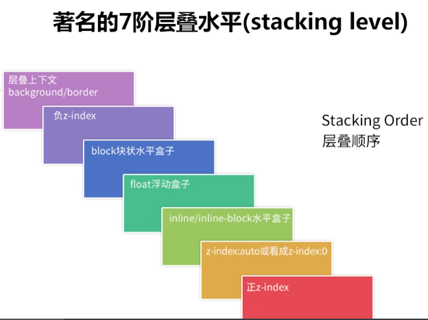

# Stacking Context,层叠上下文
----你可能不知道的z-index和transform
## 一、概念

### 1.1 Stacking Context 层叠上下文
MDN中对 Stacking Context的描述
> Stacking context is the three-dimensional conceptualization of HTML
elements along an imaginary z-axis relative to the user who is assumed
to be facing the viewport or the webpage.HTML elements occupy this
space in priority order based on element attributes.

层叠上下文是HTML元素的三维概念，这些HTML元素在一条假想的相对于面向（电脑屏幕的）视窗或者网页的用户的 z 轴上延伸，HTML 元素依据其自身属性按照优先级顺序占用层叠上下文的空间。
z轴即用户与屏幕间看不见的垂直线。

### 1.2 Stacking Level 层叠水平
层叠水平决定了同一个层叠上下文中元素在Z轴上的显示顺序

### 1.3 Stacking Order
w3c官方规定了7层层叠水平,如下图所示

- 形成层叠上下文环境的元素的背景与边框
- 拥有负 z-index 的子堆叠上下文元素 （负的越高越堆叠层级越低）
- 正常流式布局，非 inline-block，无 position 定位（static除外）的子元素
- 无 position 定位（static除外）的 float 浮动元素
- 拥有 z-index:0 的子堆叠上下文元素
- 拥有正 z-index: 的子堆叠上下文元素（正的越低越堆叠层级越低）

## 二、触发层叠上下文
根据，MDN上的描述，一下方法会触发元素的层叠上下文
- 根元素 (HTML)
- z-index 值不为 "auto"的 绝对/相对定位
- 一个 z-index 值不为 "auto"的 flex 项目 (flex item)，即：父元素 display: flex|inline-flex。（需满足两个条件才能触发：1是父级需要是display:flex或者display:inline-flex水平，2是子元素的z-index不是auto，必须是数值。则这个子元素为层叠上下文元素）
- opacity 属性值小于 1 的元素（参考 the specification for opacity）
- transform 属性值不为 "none"的元素
- mix-blend-mode 属性值不为 "normal"的元素
- filter值不为“none”的元素
- perspective值不为“none”的元素
- isolation 属性被设置为 "isolate"的元素
- position: 不为static
- 在 will-change 中指定了任意 CSS 属性，即便你没有直接指定这些属性的值
- -webkit-overflow-scrolling 属性被设置 "touch"的元素

## 使用

所以为什么定位元素会层叠在普通元素的上面？其根本原因就在于，元素一旦成为定位元素，其z-index就会自动生效，此时其z-index就是默认的auto，也就是0级别，根据上面的层叠顺序表，就会覆盖inline或block或float元素。

**层叠上下文可以嵌套，内部层叠上下文及其所有子元素均受制于外部的层叠上下文。**

### 比较两元素的上下关系
- 在同一个层叠上下文中，则根据7阶层叠水平比较。若两元素在同一层叠水平，则后来居上即在DOM流中处于后面的元素会覆盖前面的元素。
- 在不同的层叠上下文中，则直接比较父元素的层叠水平：
    - 若父元素的z-index不同，则z-index数值越大，越在上面。
    - 若父元素的z-index相同，则在DOM流中处于后面的元素会覆盖前面的元素。

>比较时，先看两个元素是不是在同一个父元素之下，若不是，则一层层往上找，直到找到其祖先元素在同一级时停止。然后，再依次往下寻找各自的子元素，找到第一个是层叠上下文元素的子元素后进行比较。

>子元素的 z-index 值只在父级层叠上下文中有意义。即父元素的 z-index 低于父元素另一个同级元素，子元素 z-index再高也没用。

## 当transform遇上了z-index
从上面知道，当transform不为none的时候，会触发元素的层叠上下文，正常情况下，按照z-index作比较就好了，但是如果开启了3d空间的transform，比如，translate3d，scale3d，rotate3d等，元素可能在z轴方向上发生变化，位移的变化要大于层级的变化，造成z-index失效的效果（safari）

**当transform的3d在safari下使z-index失效怎么解决**，[@张鑫旭老师](https://www.cnblogs.com/reaf/p/5788781.html)有篇文章给出了答案

- 父级，任意父级，非body级别，设置overflow:hidden可恢复和其他浏览器一样的渲染
- 以毒攻毒。也可以使用3D transform变换

- - -
2018.4.26
