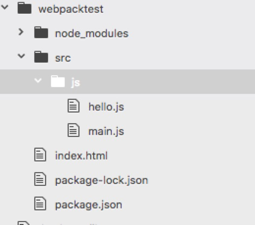

# webpack从入门到放弃
## 什么是webpack
**webpack**是前端模块化打包工具

## 为什么用webpack
- 随着web应用越来越丰富，为了简化开发的复杂度，我们要使用模块化组织代码。具体请看《模块化简述》(http://fanshunkai.com/#/mk-app-portal/markdown?210)
- webpack认为一切皆模块，最终把一切资源打包输出为可用的静态资源
- Webpack的处理速度更快更直接，能打包更多不同类型的文件。

## webpack的使用

本文以node环境下webpack的运用为例，请自行安装node和npm

1. 全局安装webpack
    ```
    $ npm install webpack -g
    ```
2. 项目中安装
    初始化npm项目,创建package.json

    ```
    $ npm init -y
    ```
    项目中安装webpack
    ```
    $ npm install --save-dev webpack
    ```
3. 创建相应的文件或文件夹,index.html,src--开发目录,src/js,src/js/main.js,src/js/hello.js
    项目结构如下：

    

    在**index.html**中写入html基础代码，引入打包后的chunk文件，命名为bundle.js
    ```
    //index.html
    <!DOCTYPE html>
    <html>
        <head>
            <meta charset="utf-8">
            <title>webpack-test</title>
        </head>
        <body>
            <div id = "app"></div>
            <script src="./build/bundle.js"></script>
        </body>
    </html>

    ```

    main.js是主入口文件
    ```
    //main.js
    var Hello = require('./hello.js');
    document.querySelector('#app').appendChild(Hello)
    ```

    hello.js是业务代码
    ```
    //hello.js
    var Hello = document.createElement('div');
    Hello.textContent = "Hello Word";
    module.exports = Hello
    ```
4. 使用webpack打包
    webpack有两个参数 webpack 入口文件  输出文件

    ```
    $ webpack ./src/js/main.js ./build/bundle.js
    ```

    如果没有全局安装，需要制定在本项目中的node_modules中的webpack
    ```
    $ ./node_modules/.bin/webpack ./src/js/main.js ./build/bundle.js
    ```
    打包完毕，浏览器打开index.html，出现"Hello Word"。webpack使用完毕

5. 配置文件webpack.config.js
    正常项目中，文件比较多，自然不能以这种方式一一打包，我们可以通过配置webpack.config.js文件实现webpack的自动化打包
    * config文件的参数解读
        * -entry： 入口文件
        * -output：输出文件
        * -module：模块，各种loader
        * -plugins：插件

    ```
    当运行webpack时，默认寻找根目录下的webpack.config.js
    //webpack.config.js
    module.exports = {
        entry:{
            bundle:'./src/js/main.js'
        },
        output:{
            filename:'./build/[name].js'
        }
    }
    ```

    运行命令webpack
    ```
    $ webpack
    ```
    打开index.html 浏览器显示"Hello Word"，跟之前手动打包一样
6. 用webpack起服务
    * 安装webpack-dev-server
    ```
    $ npm i --save-dev webpack-dev-server
    ```
    * 在package.json中配置webpack-dev-server的命令
    ```
    "scripts": {
      "start":"webpack-dev-server --content-base ./ --port 3000 --host 0.0.0.0 --hot --inline"
    },
    ```
    运行webpack-dev-server
    ```
    $ npm run start
    ```
    访问http://127.0.0.1:3000/ ,你将看到之前的"hello word",并且在hello.js中在"hello word"后面加几个感叹号
    ```
    //hello.js
    var Hello = document.createElement('div');
    Hello.textContent = "Hello Word!!!";
    module.exports = Hello
    ```
    咦，浏览器竟然刷新了，对了，我们可以在webpack-dev-server后面通过 "--" 传入参数 ，--hot --inline就是热更新的“元凶”，加上"--color --compress试试呗"

7. loaders
    * loaders
    webpack可以打包各种资源文件，但是需要不同的loaders来处理，以webpack2为例，(2和3的写法类似)
    ```
    module: {
        rules: [{
            test: /\.css$/,
            //exclude: /node_modules/,
            use: [{
                loader: 'style-loader'
            }, {
                loader: 'css-loader'
            }]
        }, {
            test: /\.less$/,
            use: [{
                loader: 'style-loader'
            }, {
                loader: 'css-loader'
            }, {
                loader: 'less-loader'
            }]
        }, {
            test: /\.js?$/,
            exclude: /node_modules/,
            use: 'babel-loader'
        }, {
            test: /\.(eot|woff|woff2|ttf|svg|png|jpe?g|gif|mp4|webm)(\?\S*)?$/,
            use: {
                loader: 'url-loader',
                options: {
                    name: '[name].[hash:8].[ext]',
                    limit: 8192
                }
            }
        },{
            test: /\.md$/,
            use: [{
                loader: "html-loader"
            }, {
                loader: "highlight-loader"
            }, {
                loader: "markdown-loader",
                options: { renderer }

            }]
        }],
        ...
    ```
8. 插件

    loaders的功能有限，在性能和其他方面，可能需要一些插件来实现，比如生成一个html就需要HtmlWebpackPlugin
    ```
    //webpack.config.js
    const HtmlWebpackPlugin = require('html-webpack-plugin'); //installed via npm
    const webpack = require('webpack'); //to access built-in plugins
    module.exports = {
        entry:{
            bundle:'./src/js/main.js'
        },
        output:{
            filename:'./build/[name].js'
        },
        module: {
            rules: [
                { test: /\.txt$/, use: 'raw-loader' }
            ]
        },
        plugins: [
            new webpack.optimize.UglifyJsPlugin(),
            new HtmlWebpackPlugin({template: './src/index.html'})
        ]
    }
    ```
    如此，一个webpack的配置就完成了，loader和plugin根据实际情况按需配置吧，这些loader和plugin都是独立的安装包，使用前请安装到本地的node_modules，具体使用方法请去webpack官网查阅


- - -
2017.11.28
